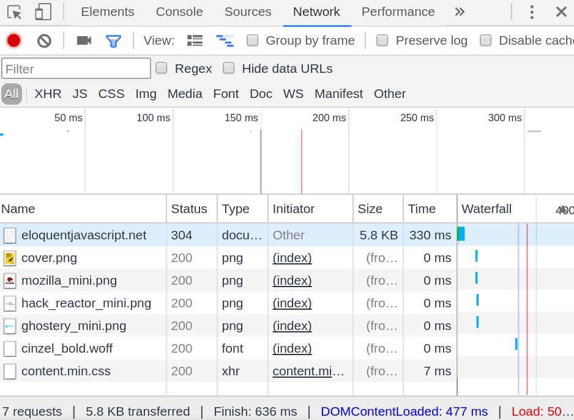
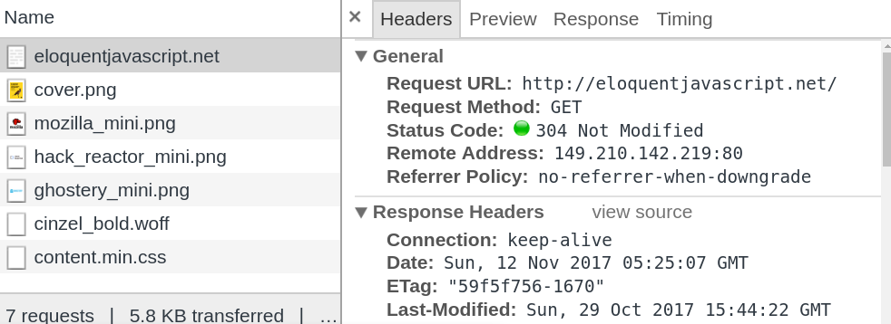

# How the Internet Works - Part 1

## Key Words

* IP Address
* Domain Name
* HTTP Status Code

## Resources

* [MDN - How the Internet Works](https://developer.mozilla.org/en-US/docs/Learn/Common_questions/How_does_the_Internet_work)
* [MDN - How the Web Works](https://developer.mozilla.org/en-US/docs/Learn/Getting_started_with_the_web/How_the_Web_works)
* [LaunchSchool - Introduction to HTTP](https://launchschool.com/books/http)
* [Dev.Opera - Http Response Codes](https://dev.opera.com/articles/http-response-codes/)
* [Video: How the Internet Works for Developers - Pt 1 - Overview & Frontend](https://www.youtube.com/watch?v=e4S8zfLdLgQ)
* [Video: How the Internet Works for Developers - Pt 2 - Servers & Scaling](https://www.youtube.com/watch?v=FTAPjr7vgxE)

## Lesson

### Finding computers

* source: [*How does the Internet work?* by mozilla contributors](https://developer.mozilla.org/en-US/docs/Learn/Common_questions/How_does_the_Internet_work)

If you want to send a message to a computer, you have to specify which one. Thus any computer linked to a network has a unique address to identify it, called an **IP address**. It's an address made of a series of four numbers separated by dots, for example: `192.168.2.10`.

To make things easier for humans, IP addresses usually have a human readable alias called a **domain name**. For example, `google.com` is the domain name used on top of the IP address `173.194.121.32`. Using the domain name is the easiest way for us to reach a computer over the Internet.

#### Activity: find the `ip` address of Eloquent Javascript

* In chrome, navigate to `http://eloquentjavascript.net/` and open the devtools. click on the `network` tab and reload the page. You should see something like this:

Under `name`, click on `eloquentjavascript.net`. A window with several tabs will open to the right. Click on the `header` tab (if not already selected).

Note the request method: `GET`, the status code `304` and the remote address, which is the ip address of eloquent javascript: `149.210.142.219:80`.

Repeat these steps for `https://www.nodejs.org`. You may consult [this site](https://httpstatuses.com/) for HTTP status codes.

## Clients and servers

Computers connected to the web are called **clients** and **servers**. A simplified diagram of how they interact might look like this:

* Clients are the web user's internet-connected devices (phone, computer, etc.) and the web-accessing software available on those devices (chrome, firefox, etc.).
* Servers are computers that store webpages, sites, or apps. When a client device wants to access a webpage, a copy of the webpage is downloaded from the server onto the client machine to be displayed in the user's web browser.

## The other parts of the toolbox

The client and server we've described above don't tell the whole story. There are many other parts involved, and we'll describe some of them below.

* **DNS**: Domain Name Servers are like an address book for websites. When you type a web address in your browser, the DNS needs to be reached first to translate the address to an ip address.
* **HTTP** (Hypertext Transfer Protocol): a protocol that defines  how clients and servers speak to each other.
* **Component files**: A website is made up of many different files, which are like the different parts of the goods you buy from the shop. These files come in two main types:
  * **Code files**: Websites are built primarily built from HTML, CSS, and JavaScript.
  * **Assets**: All the other stuff that makes up a website, such as images, music, video, Word documents, and PDFs.

## So what happens, exactly?

When you type a web address into your browser:

1. The browser goes to the DNS server, and finds the real address of the server that the website lives on.
2. The browser sends an HTTP request message to the server, asking it to send a copy of the website to the client.
3. Provided the server approves the client's request, the server sends the client a "200 OK" message, and then starts sending the website's files to the browser as a series of small chunks called data packets.
4. The browser assembles the small chunks into a complete website and displays it.

### Exercise

Using your browser's dev tool's network tab, find the ip addressess of the following websites.

**Note**: some large websites may have more than a single `ip` address.

**Note**: Many websites cannot be reached directly through their ip address (to be discussed at a later time).

* `https://www.amazon.com/`
* `https://www.google.com/`
* `https://nodejs.org/`