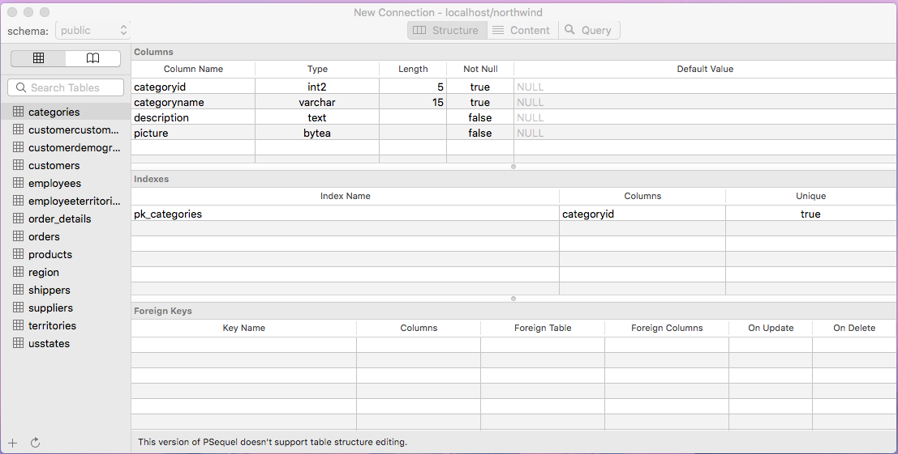

# Playing with Postgres

Go ahead and download the [northwind.sql](northwind.sql) file in this directory.
Open it in a text editor, and look at the SQL statements contained therein.
This is a file that will *seed*, or populate, a database you create.

## Challenge 1

While these might not be commands you fully understand yet, they're written
in a way that makes them pretty readable. In a new text file, write down
each new capitalized statement, and then write a short description of what you
think it does.

After [creating and naming a database](https://www.postgresql.org/docs/9.1/static/app-createdb.html) in Postgres,
drill down to the directory you saved northwind.sql in and type the following
into your command line, replacing `databasename` with whatever you named your
database:

``` bash
psql databasename < northwind.sql
```

Now, open your database up in the Postgres client you've downloaded. Depending on which
client you have, it should look something like this:



## Challenge 2

Look around, and try to map out the associations between the different tables.
Write them down in your text file.
