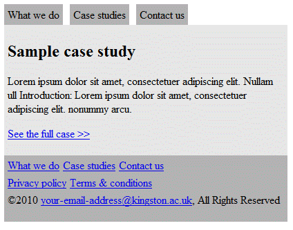

# Layout

Attribution: [Kingston University London](https://sites.google.com/site/kuhtml/exercises/exercise-set-4-css-layouts)

## Sources

- [MDN: CSS Layout](https://developer.mozilla.org/en-US/docs/Learn/CSS/CSS_layout)
- [Learn CSS Layout](http://learnlayout.com/)
- [W3Schools: CSS Navigation Bar](https://www.w3schools.com/css/css_navbar.asp)

## Instructions

Download the provided html and css files below and add the CSS to achieve the exact layout as shown below.



- [html](assets/index.html)
- [css](assets/index.css)

## Bonus

- Add `hover` effects using media queries.
- Make the edges rounded.

**Hints**:

1. How do I make each `<li>` appear on the same line?

```css
li {
  float: left;
}
```

2. How do I make footer links be 5 pixels apart?

Since all links are wrapped in `<li>` tags, and these `<li>` elements are wrapped in two `<ul>` tags, you can set margin to both `<ul>` and `<li>`. Be careful about the direction.

3. What does `#navigation li` or `#footer li` mean?

`#navigation li` is the `<li>` tag in the element whose `id` is `navigation`, in this case, the element is a `div`. Similarly, `#footer li` is the `<li>` tag in the element whose id is `footer`, which is also a `div`.