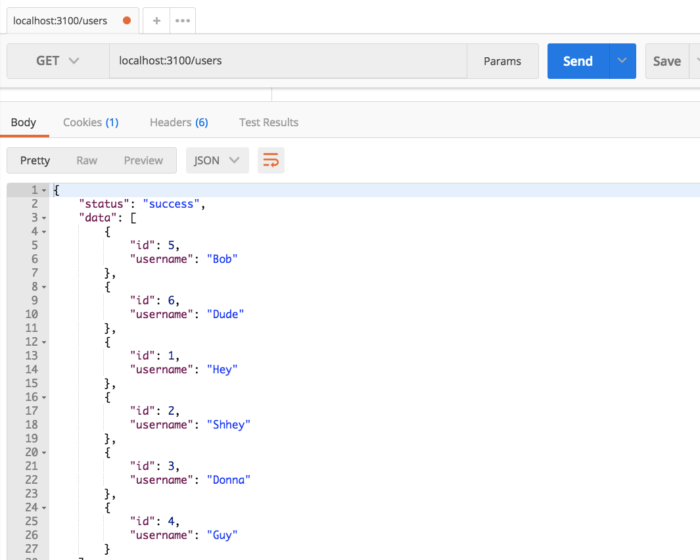
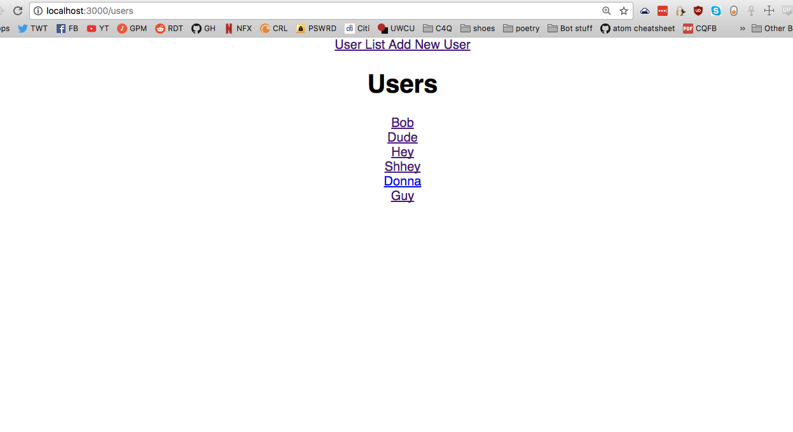

# Express, Postgres, and React

### Resources
* [Create React App with Express backend](https://daveceddia.com/create-react-app-express-backend/) - Don't rely on this for everything. He doesn't use SQL servers - instead, he just sends some boilerplate JSON. But this is the idea, and it's a great starting point.

Today, we'll finally be building a full stack app, tip to toe. This is a little scary and a little difficult to get your head around at first - it is for everyone. Bear with us, brush up on your SQL and Express, and don't forget React - we'll be bringing all of that knowledge to bear today.

## Postgres issues?

The database integration part of these notes assumes you have an instance of Postgres running.

We know that some of you are still having trouble setting up Postgres on your computers. Don't worry about that for right now. We'll help you set up Sequelite on your machine. It's a little less powerful, but way easier and very popular, so don't feel like you're getting short-changed. We'll make sure everyone has a Postgres server running by hackathon.

With that out of the way, **let's get started**.

## File Organization

Take a look at the [example project](https://github.com/crymall/express_fullstack_example/tree/master/react-backend). This is an app that renders a list of users, lets you add new users, and lets you edit existing users. That's it. By and large, it should look fairly similar to the Express apps you were working with before break. However, you'll notice two additional folders: **'client'** and **'db'**.

Looking inside the client folder might be a bit troubling. You have a separate `package.json` file in there, which means that this sub-folder has its own npm installation! What??

Don't fret. Let's break it down. There are two main places you'll want to pay attention to:

  * The **main folder** ('react-backend') is for the Express/SQL side of your app. It includes database methods (inside 'db') and backend routing (inside `app.js`). Without the 'client' folder, this would be virtually **identical** to the other Express apps that you've already made. By itself, it serves JSON objects - it is, literally, an API connected to a database.
    - In the 'bin' folder, you'll notice that we changed the default port our app is running on from `3000` to `3100`. This is because we're running our app on **two distinct ports**. More on this later.
  * The **client folder** ('client'), which handles all elements of frontend presentation using React. It makes database calls to our backend API (from lifecycle methods and form submissions), updates our state to reflect those changes, and makes our data all pretty. Critically, our React files have **no idea** what data to render without the backend. Without the backend, they're just scaffolding, much like what you see before `componentDidMount` runs in your Codesandbox apps. However, they're set up to process and represent information in the specific way our backend grabs data from columns and serves it up as JSON.
    - By default, our React apps run on port `3000`. This app is no different. However, in the `package.json` file, you'll notice an unusual key, `proxy`, pointing to port `3100` - the port our Express app is running on. This sets the default URL that we query in our AJAX requests to `http://localhost:3100/`, so that instead of saying:


    ```js
    fetch('http://localhost:3100/users')
    ```

    We can just say:

    ```js
    fetch('/users')
    ```

    And grab the result of our database query from our Express route.

## Backend Routing vs. Frontend Routing

Proxy? Backend routing? Two ports? What do we mean?

This is basically **the same thing** as running two apps at once. One that returns JSON from its routes, and one that renders HTML/CSS to the user. These apps work together to render a website.

What does this mean? Well, it means we `npm start` twice to start this app up - once in the 'client' folder, and once in our main folder. If we query the port for our Express app (not React!), we get plain JSON - just like any other API. Take a look in Postman:



This is what our *backend routing* gives us when we query the route '/users'. This is our frontend:



Same data, different package. That's what our frontend routing does for us.

At this point, you might be asking: How? How is data passed around, and how is it finally rendered for our user?

I'm glad you asked. Let's take a look at our backend routing first.

## SQL, Express, and Backend Routing

In the 'db' file, you can see we're using good old Postgres and pg-promise. We're structuring our database with one table and one column - `users` and `username`, respectively, and we're seeding it with a few common names. Our functions in `queries.js` are no different from when we created an API using Express - take `getAllUsers` as an example:

```js
function getAllUsers(req, res, next) {
  db.any('select * from users')
    .then(function (data) {
      res.status(200)
        .json({
          status: 'success',
          data: data,
          message: 'Retrieved ALL users'
        });
    })
    .catch(function (err) {
      return next(err);
    });
}
```

We're grabbing all of our users using pg-promise, then sending in the response (`res`) a status of 200 (all good) and JSON. In that JSON, we're putting the data that corresponds to the product of our SQL query (coming back to you yet?). Then we're sending it out.

Where, you ask? Take a look at our 'routes' folder, under 'users'. Right there, you'll see where we're calling our database. This is, actually, all we need to do on the database side of things.

## React and Frontend Routing

Meanwhile, way over on port `3000`, our React app is running, unaware of anything going on on the Express side. How do we fetch that data so that it appears on our frontend?

If you've done AJAX requests using React lifecycle methods, this should be familiar to you. We are using `componentDidMount`, and because of the proxy setting we added to our `package.json` file, our React app knows to send our fetch request to our Express server. Take a look at that:

```js
componentDidMount() {
  fetch('/users')
    .then(res => res.json())
    .then((users) => {
      let data = users.data;
      this.setState({ users: data })}
    );
}
```

Even though, normally, our fetch request wouldn't know where to go without a full URL (and would probably default to the React server's port), our proxy sends it right to `http://localhost:3100/users`, which grabs the JSON response from our Express server.

Let's take a look at our React routing now. Observe that even though the component that we're calling `componentDidMount` from is `http://localhost:3000/users`, we're actually sending requests to two routes on two servers when we render the component. We're pinging our React route to get our JSX template and JavaScript logic, and we're pinging our Express route to get the data to fill it in from our database.

And that's about it! With the React skills you've gained and the Express/SQL skills you'll reclaim, you're in a great position to start building full-stack apps. Yay!
