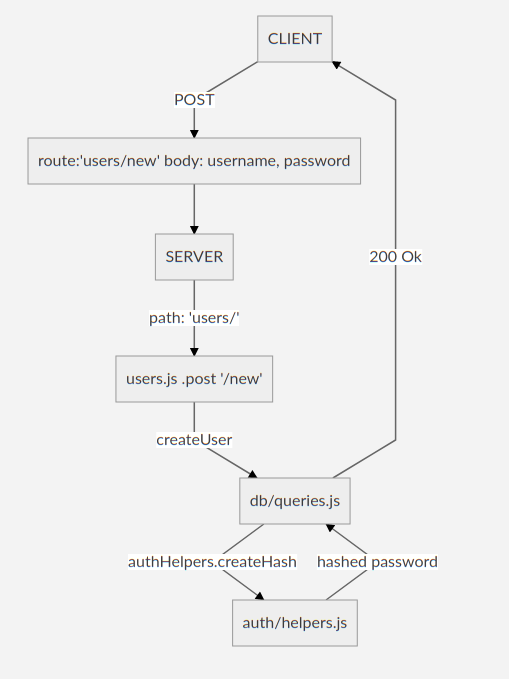
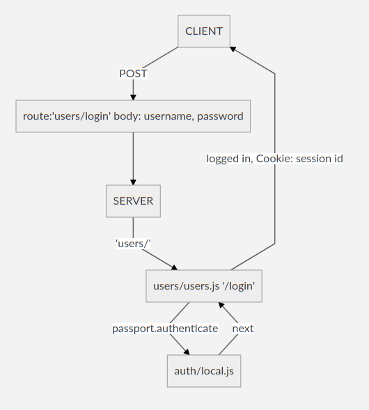

# Registering Users - Lesson 2

## Resources

* [Express React Auth 2 Repo](https://github.com/lizraeli/express_fullstack_auth_2)
* [Michael Herman's Tutorial](http://mherman.org/blog/2016/09/25/node-passport-and-postgres/)
* [Middleware - Wynne Lo](http://wynnelo.com/2015/10/middleware/)

* [Registering Users - Lesson 1](../user_registration/user_registration.md)

Today, we will continue building up a fullstack app with express, postgres and react.

## Backend: Folder Structure

The following are some of the important folders and files of the backend express server:

```text
+ auth/
  - helpers.js
  - local.js
  - passport.js
+ db/
  - index.js
  - queries.js
  - users.sql
+ routes/
  - users.js
- app.js
```

## Event Flows

There are several flows of events that can happen, starting from the client, going to the server, and back to the client.

### Register User



To register a user, a post request is sent to the route _users/new_, the request body containing the username and password. On the server side, `app.js` notes that the request route begins with `users/` and passes the request to `users/users.js` to look at the rest of the route. `users.js` notes that the request type - `POST`, and the rest of the route: `/new`, and forwards the request to the `createUser` function in `db/queries.js`. The `createUser` function creates extracts the password from the request body, creates a hash using the `createHash` function in `auth.helpers.js`. It then insert the user and hashed password into the database, and sends an `Ok` response back to the client.

### Login User



To log in, a `POST` request is sent to the route _users/login_, the request body containing the username and password. On the server side, `app.js` notes that the request route begins with `users/` and passes the request to `users/users.js` to look at the rest of the route. `users.js` notes that the request type - `POST`, and the rest of the route: `/login`. Note the unusual looking handler for this route:

```js
router.post("/login", passport.authenticate("local"), (req, res) => {
  // If this function gets called, authentication was successful.
  // `req.user` contains the authenticated user;
  res.send(`${req.user.username} is logged in`);
});
```

There are several things at play here, some new, and some that we have not discussed in depth before. First, we will turn to the concept of _middleware_.

### Middleware and Express

You may have heard the term before. Looking at the [express documentation](https://expressjs.com/en/guide/writing-middleware.html):

> Middleware functions are functions that have access to the request object (req), the response object (res), and the _next_ function in the application’s request-response cycle. The _next_ function is a function in the Express router which, when invoked, executes the middleware succeeding the current middleware.
>
> Middleware functions can perform the following tasks:
>
> * Execute any code.
> * Make changes to the request and the response objects.
> * End the request-response cycle.
> * Call the next middleware in the stack.
>
> If the current middleware function does not end the request-response cycle, it must call next() to pass control to the next middleware function. Otherwise, the request will be left hanging.

In express, an incoming request will pass through an "assembly line" of middleware functions. Most of these would do some operation pertaining to the request, and put the request back on the assembly line, to be taken up by the next middleware function. For example, the `body paser` middleware takes a request, attaches the request body to the `req.body` property, and passes the request on using `next()`. Without using the body parser at the beginning of the assembly line, there would be no `req.body` available. (the inner workings of `body parser` are not relevant for the current discussion).

We define the middleware functions to be used by calling the `app.use` method. For example, in `app.js` we tell express to use the _body parser_ to try to parse a request body in the json format.
Note that below, the call to `bodyParser.json()` will return a middleware function.

```js
app.use(bodyParser.json());
```

Middleware functions are called in the same order that we pass them to `app.use`.

For a great visual explanation of middleware check out this [article on Middleware by Wynne Lo](http://wynnelo.com/2015/10/middleware/).

### The Passport Middleware

## Exercises

Draw similar diagrams for the events flows for the following requests:

```text
GET "/HOBBIES"
PATCH "/HOBBIES
```

Note that the event flow may go in different "directions": the user may or may not be authenticated, etc.
