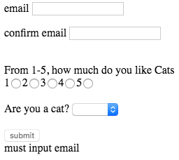

# Creating A Full-Fledged Form

### Key Concepts:
* Inputs
* State
* Props
* Functional Components
* Frontend Form Validation

Today, we're going to synthesize everything we learned about forms, inputs, and validation this week. We're going to be making a form that asks users for their e-mails and some personal information. At the end of the day, it's gonna look like this:

Let's back up and go through the user experience of this form, item by item. We have:

* Two **text inputs** asking users for an identical e-mail.
* **Radio buttons** asking users to rate cats on a scale from 1-5.
* A **select input** asking users if they are a cat, with three options: Yes, no, and maybe.
* A **button** to submit the form.
* Descriptive **step-by-step instructions** depending on a user's progress through the form.
* After submitting, a **recap** of every choice the user made. This recap updates if the user changes an item on their form.

This is a lot of stuff to manage, so we've put together a [skeleton](https://codesandbox.io/s/4znjv5v7q4) to help you. This skeleton includes three components:

* A main (stateful) component, called **App**. This component keeps track of a user's progress through the form, handles their inputs, and updates `state` accordingly. It also contains much of the JSX that the user will see as HTML, passing props to the other components as necessary.
* A functional component called **Select** which accepts props and uses them to render the select box for the question "Are you a cat?"
* A functional component called **InlineRadioGroup** which accepts props and renders our radio buttons for the question "From 1-5, how much do you like cats?"

Notice that the functional components are defined differently. One is an ES6 class and the other one is simply a JavaScript function. These work **identically** on the JSX side, but you might find that you have to refer to your props a bit differently inside the component itself. Try both ways and figure out what works best for you.

## Notes On Questions

* Unless the answer to your question irrevocably changes your app from the ground up, try to answer design questions yourself. For example, are you going to render instructions after the user submits if they (for example) change their email? Or are you going to disable the inputs? You decide.
* If you come across a bug, please make sure you do your due diligence of Googling the problem before you come to us. After you search, if you still can't figure it out, try to come up with specific questions about the problem, or tell us what you speculate the issue is. This helps us understand where you're at and resolve things quicker.

